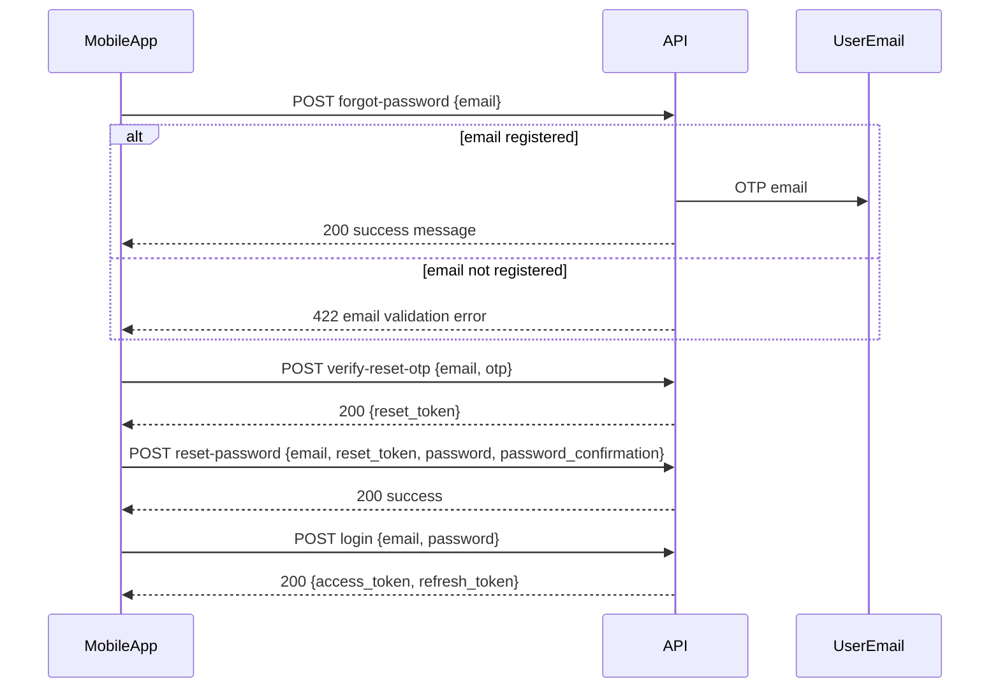

# Mobile API: Password Reset (OTP)

API reference for native/mobile clients implementing forgot-password with email OTP.

**Base path:** `/api/v1`  
**Authentication:** None required for these three endpoints (guest).  
**Content type:** `application/json` for request and response bodies.

---

## Overview

Password reset is a **3-step** flow. After step 3, the user must log in again with the new password (`POST /api/v1/auth/login`).

```text
1. POST /auth/forgot-password     → Send 6-digit OTP to user's email
2. POST /auth/verify-reset-otp  → Verify OTP, receive reset_token
3. POST /auth/reset-password      → Set new password using reset_token
4. POST /auth/login               → Login with new credentials (separate endpoint)
```



### Timing and limits (server config)

| Setting | Default | Description |
|---------|---------|-------------|
| OTP length | 6 digits | Numeric only (e.g. `042891`) |
| OTP validity | 10 minutes | After this, request a new OTP |
| Reset token validity | 30 minutes | After OTP verify; use before reset |
| Max wrong OTP attempts | 5 | Then status `locked`; request new OTP |
| Send OTP rate limit | 1 / minute | Per email + IP |
| Verify OTP rate limit | 10 / minute | Per email + IP |

### Security behaviour

- **Step 1** returns `422` with an `email` validation error if the address is **not registered** in `users`.
- OTP and reset tokens are stored **hashed** on the server; only the plain OTP (email) and plain `reset_token` (API response) are shown to the user once.
- After a successful password reset, existing **mobile** Sanctum tokens (`mobile-access`, `mobile-refresh`) for that user are revoked.
- Email is normalized to **lowercase** on the server; send the same email the user registered with.

---

## Common request headers

| Header | Value | Required |
|--------|--------|----------|
| `Accept` | `application/json` | Recommended |
| `Content-Type` | `application/json` | Required for POST bodies |

**Do not send** `Authorization` for these endpoints.

### Example base URL

| Environment | Base URL |
|-------------|----------|
| Local | `http://127.0.0.1:8000` |
| Production | Your deployed `APP_URL` |

Full URL example: `http://127.0.0.1:8000/api/v1/auth/forgot-password`

---

## Common response patterns

### Success (2xx)

Business success responses use a simple JSON object:

```json
{
  "message": "Human-readable message"
}
```

Step 2 also includes `data`:

```json
{
  "data": { "reset_token": "..." },
  "message": "..."
}
```

### Validation error (422)

Returned when request body fails validation (missing fields, wrong format, weak password).

```json
{
  "message": "The email field is required. (and 1 more error)",
  "errors": {
    "email": [
      "The email field is required."
    ]
  }
}
```

Field keys match JSON body keys: `email`, `otp`, `reset_token`, `password`, `password_confirmation`.

### Business logic error (422)

Returned when validation passed but the OTP/reset token is wrong, expired, or locked.

```json
{
  "error": {
    "code": "otp_invalid",
    "message": "The verification code is invalid."
  }
}
```

Mobile apps should branch on `error.code` (not only HTTP status).

### Rate limit (429)

Too many requests (send or verify throttled).

```json
{
  "message": "Too Many Attempts."
}
```

Optional headers (Laravel throttle):

| Header | Description |
|--------|-------------|
| `Retry-After` | Seconds until retry allowed |
| `X-RateLimit-Limit` | Max attempts in window |
| `X-RateLimit-Remaining` | Remaining attempts |

### Server error (500)

Unhandled exception. Body format may vary; typical Laravel debug response when `APP_DEBUG=true`:

```json
{
  "message": "Server Error"
}
```

**Mobile handling:** Show a generic “Something went wrong” message; do not expose stack traces to users.

### Service unavailable (503)

Maintenance mode or upstream failure. Treat like 500 for UX.

### Method not allowed (405)

Wrong HTTP method (e.g. GET instead of POST).

### Not found (404)

Wrong URL path (not used for valid forgot-password flow on correct paths).

---

## 1. Send OTP

Request a password-reset verification code by email.

| | |
|---|---|
| **Method** | `POST` |
| **URL** | `/api/v1/auth/forgot-password` |
| **Route name** | `api.v1.auth.forgot-password` |
| **Auth** | None |
| **Throttle** | `password-reset-otp-send` (1 request/minute per email + IP) |

### Request body

| Field | Type | Required | Rules |
|-------|------|----------|--------|
| `email` | string | Yes | Valid email, max 255 chars, must pass app email format rule |

**Example:**

```json
{
  "email": "user@example.com"
}
```

### Success response

**HTTP status:** `200 OK`

```json
{
  "message": "A verification code was sent to your email."
}
```

**Notes:**

- Only returned when the email exists in `users`.
- A **6-digit OTP** is emailed immediately (synchronous send; no queue worker required).
- Requesting again **supersedes** any previous pending OTP for that email.

### Error responses

| Status | Condition | Example body |
|--------|-----------|--------------|
| `422` | Email not registered | `errors.email`: "The email address is invalid." |
| `422` | Validation failed (format) | `errors.email`: required, invalid format |
| `429` | Too many send attempts | `message`: "Too Many Attempts." |
| `500` | Server/mail failure | Generic error |

**Validation examples:**

```json
{
  "message": "The email address is invalid.",
  "errors": {
    "email": ["The email address is invalid."]
  }
}
```

Returned when the email format is valid but **no user** exists with that address.

```json
{
  "message": "The email field is required.",
  "errors": {
    "email": ["The email field is required."]
  }
}
```

```json
{
  "message": "The email field must be a valid email address.",
  "errors": {
    "email": ["The email field must be a valid email address."]
  }
}
```

---

## 2. Verify OTP

Verify the 6-digit code from email and receive a `reset_token` for the password step.

| | |
|---|---|
| **Method** | `POST` |
| **URL** | `/api/v1/auth/verify-reset-otp` |
| **Route name** | `api.v1.auth.verify-reset-otp` |
| **Auth** | None |
| **Throttle** | `password-reset-otp-verify` (10 requests/minute per email + IP) |

### Request body

| Field | Type | Required | Rules |
|-------|------|----------|--------|
| `email` | string | Yes | Same as step 1; must match the email used in step 1 |
| `otp` | string | Yes | Exactly **6 digits** (e.g. `"123456"`) |

**Example:**

```json
{
  "email": "user@example.com",
  "otp": "123456"
}
```

### Success response

**HTTP status:** `200 OK`

```json
{
  "data": {
    "reset_token": "aBcDeFgH1234567890abcdefghijklmnopqrstuvwxyz0123456789ABCD"
  },
  "message": "Verification code accepted."
}
```

| Field | Description |
|-------|-------------|
| `data.reset_token` | Opaque string, **64 characters**. Store securely in memory until step 3. Valid ~30 minutes. Single-use after password reset. |

### Business error responses (422)

| `error.code` | When | `message` (English, may be translated) |
|--------------|------|----------------------------------------|
| `otp_invalid` | Wrong code (attempts incremented) | The verification code is invalid. |
| `otp_expired` | No pending OTP, expired, or superseded by new send | The verification code has expired. Please request a new one. |
| `otp_locked` | 5 failed attempts | Too many invalid attempts. Please request a new verification code. |

**Example:**

```json
{
  "error": {
    "code": "otp_invalid",
    "message": "The verification code is invalid."
  }
}
```

**Mobile UX:**

- On `otp_invalid`: allow retry until locked.
- On `otp_expired` or `otp_locked`: navigate back to step 1 and request a new OTP.

### Validation error responses (422)

| Field | Common causes |
|-------|----------------|
| `email` | Missing, invalid format |
| `otp` | Missing, not 6 digits, contains letters |

**Example:**

```json
{
  "message": "The otp field must be 6 digits.",
  "errors": {
    "otp": ["The otp field must be 6 digits."]
  }
}
```

### Other statuses

| Status | Condition |
|--------|-----------|
| `429` | Too many verify attempts |
| `500` | Server error |

---

## 3. Reset password

Set a new password using the `reset_token` from step 2.

| | |
|---|---|
| **Method** | `POST` |
| **URL** | `/api/v1/auth/reset-password` |
| **Route name** | `api.v1.auth.reset-password` |
| **Auth** | None |
| **Throttle** | Group default: 60 requests/minute per IP |

### Request body

| Field | Type | Required | Rules |
|-------|------|----------|--------|
| `email` | string | Yes | Same email as steps 1–2 |
| `reset_token` | string | Yes | Exactly **64 characters** from step 2 |
| `password` | string | Yes | App password policy (see below) |
| `password_confirmation` | string | Yes | Must match `password` |

**Example:**

```json
{
  "email": "user@example.com",
  "reset_token": "aBcDeFgH1234567890abcdefghijklmnopqrstuvwxyz0123456789ABCD",
  "password": "NewPassword1!",
  "password_confirmation": "NewPassword1!"
}
```

### Password rules

Uses Laravel `Password::defaults()` (same as registration). Typically:

- Minimum **8 characters**
- Must be **confirmed** (`password_confirmation` must match)
- May require mixed case, numbers, and symbols depending on framework defaults

**Example valid password:** `NewPassword1!`

**Validation example (weak password):**

```json
{
  "message": "The password field must be at least 8 characters.",
  "errors": {
    "password": ["The password field must be at least 8 characters."]
  }
}
```

```json
{
  "message": "The password field confirmation does not match.",
  "errors": {
    "password": ["The password field confirmation does not match."]
  }
}
```

### Success response

**HTTP status:** `200 OK`

```json
{
  "message": "Password reset successful."
}
```

**Side effects:**

- User password updated.
- Reset token consumed (cannot be reused).
- Mobile Sanctum tokens for that user revoked.

**Next step:** Call `POST /api/v1/auth/login` with the new password.

### Business error responses (422)

| `error.code` | When | `message` (English) |
|--------------|------|---------------------|
| `reset_token_invalid` | Wrong token or user missing | The password reset token is invalid. |
| `reset_token_expired` | Token expired, already used, or no verified session | The password reset session has expired. Please start again. |

**Example:**

```json
{
  "error": {
    "code": "reset_token_expired",
    "message": "The password reset session has expired. Please start again."
  }
}
```

**Mobile UX:** On `reset_token_expired` or `reset_token_invalid`, restart flow from step 1.

### Validation error responses (422)

| Field | Common causes |
|-------|----------------|
| `email` | Missing, invalid |
| `reset_token` | Missing, length ≠ 64 |
| `password` | Missing, too weak, not confirmed |
| `password_confirmation` | Missing, mismatch |

**Example:**

```json
{
  "message": "The reset token field must be 64 characters.",
  "errors": {
    "reset_token": ["The reset token field must be 64 characters."]
  }
}
```

### Other statuses

| Status | Condition |
|--------|-----------|
| `429` | Global API throttle (60/min) |
| `500` | Server error |

---

## 4. Login after reset (reference)

Not part of the OTP flow, but required to obtain API tokens.

| | |
|---|---|
| **Method** | `POST` |
| **URL** | `/api/v1/auth/login` |

**Body:**

```json
{
  "email": "user@example.com",
  "password": "NewPassword1!"
}
```

**Success (200):** Returns `access_token`, `refresh_token`, and user object.

**Note:** Users with **two-factor authentication** enabled receive `422` with `error.code`: `two_factor_required` and must use the web login flow for 2FA.

---

## Error code quick reference

| Code | Step | HTTP | Action for mobile app |
|------|------|------|------------------------|
| — | Any | `422` | Show field errors from `errors` object |
| — | Any | `429` | Show “Try again later”; honor `Retry-After` |
| — | Any | `500`/`503` | Generic server error |
| `otp_invalid` | 2 | `422` | Wrong code; retry or show attempts remaining |
| `otp_expired` | 2 | `422` | Go to step 1, request new OTP |
| `otp_locked` | 2 | `422` | Go to step 1, request new OTP |
| `reset_token_invalid` | 3 | `422` | Restart from step 1 |
| `reset_token_expired` | 3 | `422` | Restart from step 1 |

---

## Postman / cURL examples

### Step 1 — Send OTP

```bash
curl -X POST "http://127.0.0.1:8000/api/v1/auth/forgot-password" \
  -H "Accept: application/json" \
  -H "Content-Type: application/json" \
  -d '{"email":"user@example.com"}'
```

### Step 2 — Verify OTP

```bash
curl -X POST "http://127.0.0.1:8000/api/v1/auth/verify-reset-otp" \
  -H "Accept: application/json" \
  -H "Content-Type: application/json" \
  -d '{"email":"user@example.com","otp":"123456"}'
```

### Step 3 — Reset password

```bash
curl -X POST "http://127.0.0.1:8000/api/v1/auth/reset-password" \
  -H "Accept: application/json" \
  -H "Content-Type: application/json" \
  -d '{
    "email":"user@example.com",
    "reset_token":"PASTE_64_CHAR_TOKEN",
    "password":"NewPassword1!",
    "password_confirmation":"NewPassword1!"
  }'
```

---

## Implementation checklist (mobile)

- [ ] Store `email` across all three screens
- [ ] Store `reset_token` only between verify and reset screens (secure storage)
- [ ] Do not cache OTP after verify step
- [ ] On step 1 `422` for `email`, show "The email address is invalid." (unregistered email)
- [ ] Handle `error.code` for steps 2 and 3
- [ ] On success of step 3, navigate to login (tokens are not returned from reset)
- [ ] OTP input: numeric keyboard, 6 digits
- [ ] Respect rate limits; disable “Resend” for ~60 seconds after send

---

## Related backend docs

- [SendPasswordResetOtp](../backend/actions/SendPasswordResetOtp.md)
- [VerifyPasswordResetOtp](../backend/actions/VerifyPasswordResetOtp.md)
- [ResetPasswordWithOtp](../backend/actions/ResetPasswordWithOtp.md)
- [PasswordResetController](../backend/controllers/ApiV1PasswordResetController.md)
- [Routes reference](./routes.md) (PasswordResetController section)
