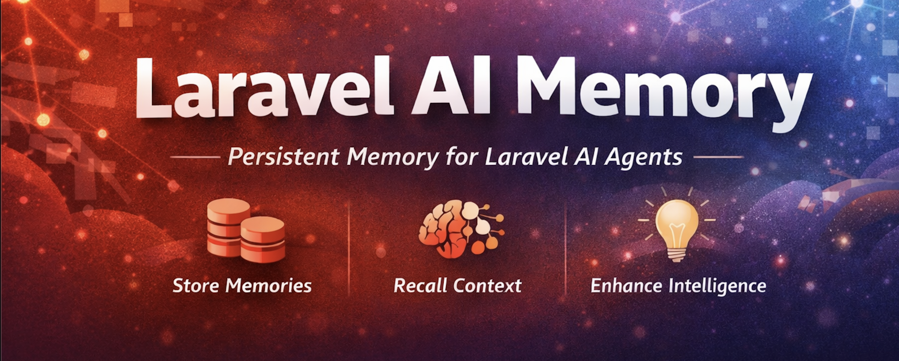

# Laravel AI Memory



Agentic memory for [Laravel AI SDK](https://github.com/laravel/ai). It keeps your agent in context.

## Requirements

- PHP 8.4+
- Laravel 12+
- laravel AI SDK
- A vector compatible database, preferably PostgreSQL with [pgvector](https://github.com/pgvector/pgvector) extension

## Use cases
* **Personalization**: remember user preferences (tone, language, choices, and more...).
* **Continuity**: retain prior issues, steps tried, and outcomes.
* **Workflows**: resume tasks with stored constraints, decisions, and last-known state.
* **Context**: keep shared conventions, requirements, and decisions for consistent agent behavior.
* **Multi-agent/tool handoff**: persist facts so different agents/tools can coordinate without repeating context.
* **Scoped memory**: store only approved, minimal facts instead of full conversation history.


## Installation

```bash
composer require eznix86/laravel-ai-memory
```

Run the migrations:

```bash
php artisan migrate
```

Optionally publish the config:

```bash
php artisan vendor:publish --tag=memory-config
```

## Usage

### AgentMemory Facade

```php
use Eznix86\AI\Memory\Facades\AgentMemory;

// Store a memory
$memory = AgentMemory::store('User prefers dark mode', ['user_id' => $userId]);

// Recall relevant memories (semantic search + reranking)
$memories = AgentMemory::recall('What are the user preferences?', ['user_id' => $userId], limit: 5);

// Get all memories for a user
$all = AgentMemory::all(['user_id' => $userId]);

// Delete a specific memory
AgentMemory::forget($memoryId);

// Delete all memories for a user
AgentMemory::forgetAll(['user_id' => $userId]);
```

### Agent Tools

Attach memory capabilities to any Laravel AI agent:

```php
use Eznix86\AI\Memory\Tools\RecallMemory;
use Eznix86\AI\Memory\Tools\StoreMemory;
use Laravel\Ai\Contracts\Agent;
use Laravel\Ai\Contracts\HasTools;
use Laravel\Ai\Promptable;

class MyAgent implements Agent, HasTools
{
    use Promptable;

    public function __construct(
        protected array $context = [],
    ) {}

    public function instructions(): Stringable|string
    {
        return 'You are a helpful assistant with memory. Use Store Memory tool to save facts about the conversation.';
    }

    public function tools(): iterable
    {
        return [
            (new RecallMemory)->context($this->context),
            (new StoreMemory)->context($this->context),
        ];
    }
}
```

The AI agent will automatically decide when to store and recall memories using these tools.

### WithMemory Middleware

Automatically prepend relevant memories to every agent prompt:

```php
use Eznix86\AI\Memory\Middleware\WithMemory;
use Laravel\Ai\Contracts\HasMiddleware;

class MyAgent implements Agent, HasTools, HasMiddleware
{
    use Promptable;

    // ... tools() and instructions() ...
    

    public function middleware(): array
    {
        return [
            new WithMemory($this->context, limit: 5),
        ];
    }
}
```

When a user prompts the agent, the middleware will:
1. Search for relevant memories using the prompt text
2. Prepend them to the prompt as context
3. The agent sees them before responding

### Using the Agent

```php
$agent = new MyAgent(['user_id' => auth()->id()]);
$response = $agent->prompt('What do you remember about my preferences?');

echo $response->text;
```

## Configuration

Publish the config file to customize defaults:

```bash
php artisan vendor:publish --tag=memory-config
```

Available options in `config/memory.php`:

| Option                     | Default    | Description                                          |
|----------------------------|------------|------------------------------------------------------|
| `dimensions`               | `1536`     | Embedding vector dimensions (must match your model)  |
| `similarity_threshold`     | `0.5`      | Minimum cosine similarity for recall                 |
| `recall_limit`             | `10`       | Default max memories returned by `recall()`          |
| `middleware_recall_limit`  | `5`        | Default memories injected by middleware              |
| `recall_oversample_factor` | `2`        | Candidates fetched before reranking (limit × factor) |
| `table`                    | `memories` | Database table name                                  |

You can also set these via environment variables:

```env
MEMORY_DIMENSIONS=1536
MEMORY_SIMILARITY_THRESHOLD=0.5
MEMORY_RECALL_LIMIT=10
MEMORY_MIDDLEWARE_RECALL_LIMIT=5
MEMORY_RECALL_OVERSAMPLE_FACTOR=2
MEMORY_TABLE=memories
```

## How It Works

1. **Store** — Content is converted to an embedding vector via `Str::of($content)->toEmbeddings()` and saved alongside the text in PostgreSQL with pgvector.

2. **Recall** — The query is embedded, then `whereVectorSimilarTo()` finds candidates by cosine similarity. Results are reranked via `$collection->rerank('content', $query)` for higher relevance.

3. **Middleware** — Before the agent sees the prompt, `WithMemory` recalls relevant memories and prepends them as context.

## Testing

This package uses [Pest](https://pestphp.com) with [TestContainers](https://testcontainers.com) for PostgreSQL + pgvector integration tests.

```bash
./vendor/bin/pest
```

### Testing with `AgentMemory::fake()`

Use `AgentMemory::fake()` to fake all underlying AI services in one call. It uses deterministic embeddings internally, so `store()` → `recall()` just works:

```php
use Eznix86\AI\Memory\Facades\AgentMemory;

test('agent remembers user preferences', function () {
    AgentMemory::fake();

    AgentMemory::store('User prefers dark mode', ['user_id' => 'user-123']);

    $memories = AgentMemory::recall('preferences', ['user_id' => 'user-123']);

    expect($memories)->toHaveCount(1)
        ->and($memories->first()->content)->toBe('User prefers dark mode');
});
```

When testing agents with the `WithMemory` middleware, `AgentMemory::fake()` handles everything — no need to separately fake `Embeddings` or `Reranking`:

```php
test('agent receives memory context', function () {
    AgentMemory::fake();

    AgentMemory::store('User lives in Mauritius', ['user_id' => 'user-123']);

    $receivedPrompt = null;
    MyAgent::fake(function (string $prompt) use (&$receivedPrompt) {
        $receivedPrompt = $prompt;
        return 'Got it!';
    });

    $agent = new MyAgent(['user_id' => 'user-123']);
    $agent->prompt('Where do I live?');

    expect($receivedPrompt)
        ->toContain('User lives in Mauritius')
        ->toContain('Where do I live?');
});
```

You can also pass custom reranking responses to control the order of recalled memories:

```php
use Laravel\Ai\Responses\Data\RankedDocument;

AgentMemory::fake([
    [
        new RankedDocument(index: 0, document: 'First result', score: 0.9),
        new RankedDocument(index: 1, document: 'Second result', score: 0.8),
    ],
]);
```

## License

MIT
